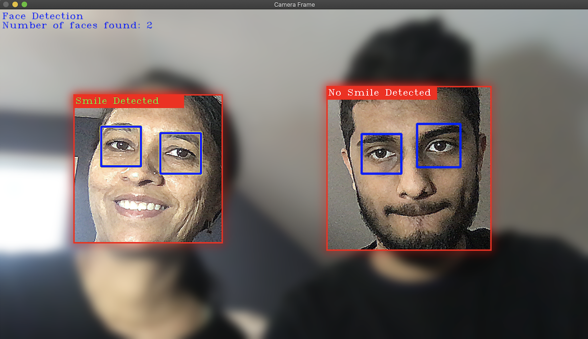

## Face Detection and Image Processing

Introductory project to learn basic OpenCV and image processing.  

Created a program that detects faces, eyes and smiles and outlines them. 
After detecting faces, each face is sharpened using a common image sharpening convolution kernel 
and the background is smoothed using a Gaussian Blur.

## Screenshots
 
 (Not the best picture of my Mom and I)
## Installation on CLion
To install and run this Project on CLion:
1. Clone the repository 
2. Install the latest version of OpenCV
3. Open CLion, and select "Open or Import" and select the cloned repository 
4. Right click "CMakeLists.txt" and select "Reload CMake project" to ensure OpenCV is found
5. Go to Run > Edit Configurations > Ensure Working Directory is selected as the current directory so the program can find the three Haar Cascade files included in the repository 
   * The three Haar Cascade files were taken from OpenCV's collection of Haar Cascade files so if you wish to use a different Haar Cascade from there such as "haarcascade_frontalface_alt.xml" then include the file path when you load the Haar Cascade 
6. Run project
## Usage
When the project is run, it will open your web-cam, start detecting faces and filtering the image  

To quit the program press any key and it will terminate.

## References and Acknowledgment
[1] [OpenCV C++ Face Detection](https://www.geeksforgeeks.org/opencv-c-program-face-detection/)  
[2] [Image Filtering](https://docs.opencv.org/master/d4/d86/group__imgproc__filter.html#gaabe8c836e97159a9193fb0b11ac52cf1)  
[3] [Cascade Classifier](https://docs.opencv.org/3.4/db/d28/tutorial_cascade_classifier.html)  
[4] [Drawing Functions](https://docs.opencv.org/master/d6/d6e/group__imgproc__draw.html)  
[5] [OpenCV: Filters & Arithmetic Operations](https://medium.com/@almutawakel.ali/opencv-filters-arithmetic-operations-2f4ff236d6aa)  
[6] [Verify Rect Object is Inside Mat Object ](https://stackoverflow.com/questions/29120231/how-to-verify-if-rect-is-inside-cvmat-in-opencv) (used in line 105) 

